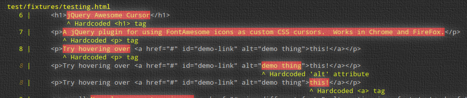

# i18n-lint [](http://semver.org/spec/v2.0.0.html)
> Detect possible instances of untranslated strings being used in HTML and HTML-derived template languages

[](https://travis-ci.org/jwarby/i18n-lint)
[](https://david-dm.org/jwarby/i18n-lint)
[](https://david-dm.org/jwarby/i18n-lint#info=devDependencies)
[](https://coveralls.io/github/jwarby/i18n-lint?branch=master)

`i18n-lint` is a tool for detecting hardcoded (untranslated) strings in HTML and template source files.  It can be used a CLI utility, or as library.
`i18n-lint` detects instances where a HTML element's text node or certain attributes look like a hardcoded string.

See <https://jwarby.github.io/i18n-lint/> for the full documentation and demos.



## Getting started

### Installing

Install using npm:

```shell
  $ npm install -g jwarby/i18n-lint
```

Installing globally will give you access to the `i18n-lint` binary from anywhere.

## Documentation

See <https://jwarby.github.io/i18n-lint/> for the full documentation.

### CLI

The CLI program is called `i18n-lint`, and will be available once `i18n-lint` has been installed globally.

Usage:

```shell
  $ i18n-lint [OPTIONS] <file ...>
```

#### Program help and information

- Run `i18n-lint --help` or `i18n-lint -h` to display help output and then exit
- Run `i18n-lint --version` or `i18n-lint -V` to display version and then exit
- Run `man i18n-lint` on systems which support `man` to view the Linux manual page

#### Linting files

To lint a file, call `i18n-lint <file>`:

```shell
  $ i18n-lint some_file.html
```

You can use a glob pattern too:

```shell
  $ i18n-lint app/views/**/*.html
```

#### Options

##### `-h, --help`

Display help and then exit

##### `-V, --version`

Display version information and then exit

##### `-t, --template-delimiters <delimiters>`

Set the template delimiters which the source files use.  The value should be the start and
end delimiters, separated by a comma.  For example, if running
`i18n-lint` against template files which use a Mustache-like syntax, use the following:

```shell
  $ i18n-lint -t "{{,}}" views/**/*.hbs
```

Similarly, but for EJS-syntax:

```shell
  $ i18n-lint -t "<%,%>" views/**/*.ejs
```

##### `-a, --attributes <attributes>`
###### default: `alt,placeholder,title`

A comma-separated list of which HTML attributes should be checked.

##### `-i, --ignore-tags <tags>`
###### default: `style,script`

A comma-separated list of HTML tags to ignore when searching for hardcoded strings.

##### `-r, --reporter <reporter>`
###### default: `default`

The reporter to use when outputting information.  The reporters follow the same structure as
JSHint reporters, and the `i18n-lint` library reports error in the same manner as JSHint - this
means you can use any existing JSHint reporters as reporters for `i18n-lint`!

There are 3 built-in reporters that get shipped with `i18n-lint`: `default`, `unix` and `json`.

To write your own reporters, look to `lib/reporters/*.js` as a starting point.

##### `--exclude <patterns>`

A comma-separated list of file patterns to exclude, such as `'docs/,ignored.html'`.

##### `--color/--no-color`

Maintain/turn off colored output.  For more info, see <https://www.npmjs.com/package/chalk#chalk-supportscolor>.

##### `--config`

##### default: `.i18n-lint.json`

Configuration file name. Options specified in optional configuration file will be used if not specified in the command line (CLI has a priority).

##### `--init`

Generate configuration file. This will generate a configuration file with a default name of `.i18n-lint.json` or the one specified in `--config`. Options specified in the command line will be saved in the file.

**Note:** Tool will quit after saving the configuration file, linting will not be performed when `--init` option is specified.

#### Exit Status

- `0`: if everything went OK, and no hardcoded strings were found
- `1`: if hardcoded strings were found
- `64`: command-line usage error, e.g. no input files provided (`[EX_USAGE]`)
- `66`: cannot open input, e.g. input files I/O error, specified reporter file does not exist (`[EX_NOINPUT]`)
- `51`: trying to save configuration (with `--init` option) to an existing file
- `52`: error when generating configuration file (with `--init` option)
- `70`: internal software error (`[EX_SOFTWARE]`)

#### Colored Output

To maintain colored output, run `i18n-lint` with the `--color` flag:

```shell
  $ i18n-lint --color **/*.html | less -R
```

### Configuration file

Options can be defined in a configuration file.

The default name of the configuration file is `.i18n-lint.json` located in the project root folder (where the package.json is located). The name can be overridden using `--config` command line parameter.

The configuration file can be initialized using the `--init` command line parameter.

The configuration file format:

```json
{
  "templateDelimiters": [ ["{", "}"] ],
  "attributes": [ "alt", "placeholder", "title", "label", "friendly-message" ],
  "ignoreTags": [ "style", "script", "pre", "code" ],
  "include": [ "**/mycomponents/**/*.html", "myfile.html5" ],
  "exclude": [ "**/__mytests__/**/*.html", "test1.html" ]
}
```

**Note:** Options specified in command line will overwrite settings read from configuration file.

### Library

To use `i18n-lint` as a library, install it locally and `require` it in your projects:

```shell
  $ npm install --save-dev i18n-lint
```

```javascript
var I18nLint = require('i18n-lint');

var errors = I18nLint('some_file.ejs', {
  templateDelimiters: [['<%','%>']],
  attributes: ['title', 'alt', 'data-custom-attr']
});
```

> **Note:** prior to v1.1.0, only a single set of template delimiters could
> be passed. However, the legacy single-depth API is still supported, ie:
> `templateDelimiters: ['<%', '%>']` will still work (but is not recommended).

If you want to scan a string instead of reading in a file, you can use the `scan` function:

```javascript
var I18nLint = require('i18n-lint');

var context = '<h1>Some hardcoded string</h1>\n<br>\n<p>\ncontent not translated</p>';

var options = {
  // ...snip...
};

var errors = I18nLint.scan(context, options);
```

The scan function can also accept a `fileName` parameter:

```javascript
var I18nLint = require('i18n-lint');

var stdin = '';

// Read stdin stream
// ...snip...

// Once stdin has finished...
var errors = I18nLint(context, options, 'stdin');
```

This allows more meaningful output when the reporters print a filename.

#### Options

Options are passed as an object, as the second parameter to `i18n-lint`.

##### `templateDelimiters`
###### type: `Array`, default: `[]`

Specify the start and end template delimiters which the source files use.  We can specify
multiple delimiters if needed. For example, when linting EJS files:

```javascript
  I18nLint('file.ejs', {
    templateDelimiters: [['<%', '%>']]
  });
```

##### `attributes`
###### type: `Array`, default: `['alt', 'placeholder', 'title']`

Specify which HTML attributes to check when searching for hardcoded strings.

##### `ignoreTags`
###### type: `Array`, default: `['style', 'script', 'pre', 'code']`

An array of tags which should be ignored when searching for hardcoded strings.

#### Using Reporters

When using `i18n-lint` as a library, you can still use the reporters:

```javascript
console.log(I18nLint.reporters);
// {
//  default: [Function]
// }

var reporter = I18nLint.reporters.default;
var errors = I18nLint('file.html', {});

reporter(errors);
```

There are currently 3 built-in reporters: `default`, `unix` and `json`.

To use other reporters, simply require them:

```javascript
var I18nLint = require('i18n-lint');
var reporter = require('i18n-lint-awesome-reporter');

reporter(I18nLint('file.html', {}));
```

#### Error Format

```javascript
{
  file: '', // string, file which contains the errors,
  error: {
    id: String, // usually '(error)'
    code: String, // warning code (see Warning Numbers)
    reason: String, // message describing the error
    evidence: RegExp, // with the offending text in match groups
    line: Number, // line number of the error
    character: Number, // column where evidence begins
    scope: String // where the error was found
  }
}
```

### Grunt

There is a grunt task which wraps `i18n-lint`'s functionality, which
can be found at <https://github.com/jwarby/grunt-i18n-lint>.

## Warning Numbers

- `W001`: hardcoded text node found
- `W002`: hardcoded attribute value found

## Contributing

See [CONTRIBUTING.md](https://github.com/jwarby/i18n-lint/blob/master/CONTRIBUTING.md).

### Running Tests

- `npm test`
  - lints JS files in `bin/`, `lib/` and `test/`
  - runs [`mocha`](http://mochajs.org) test suite

#### Generate Code Coverage Report

- `npm run-script coverage`
  - coverage is output to a `./coverage` directory

## Release History

`i18n-lint` follows [SemVer](http://semver.org/spec/v2.0.0.html) rules for version numbers.


### v1.1.0
> 23rd Aug 2020

- Support for more than one set of template delimiters add - thanks @alexmorvan

### v1.0.0
> 18th Sep 2019

First published release.

## License

Copyright (c) 2015 James Warwood.  Licensed under the MIT license.

## Authors

See [AUTHORS.txt](https://github.com/jwarby/i18n-lint/blob/master/AUTHORS.txt).
## Acknowledgements

- CLI app scaffolding from <https://github.com/Hypercubed/generator-commander>
